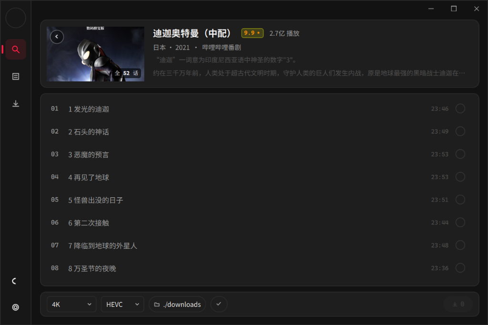
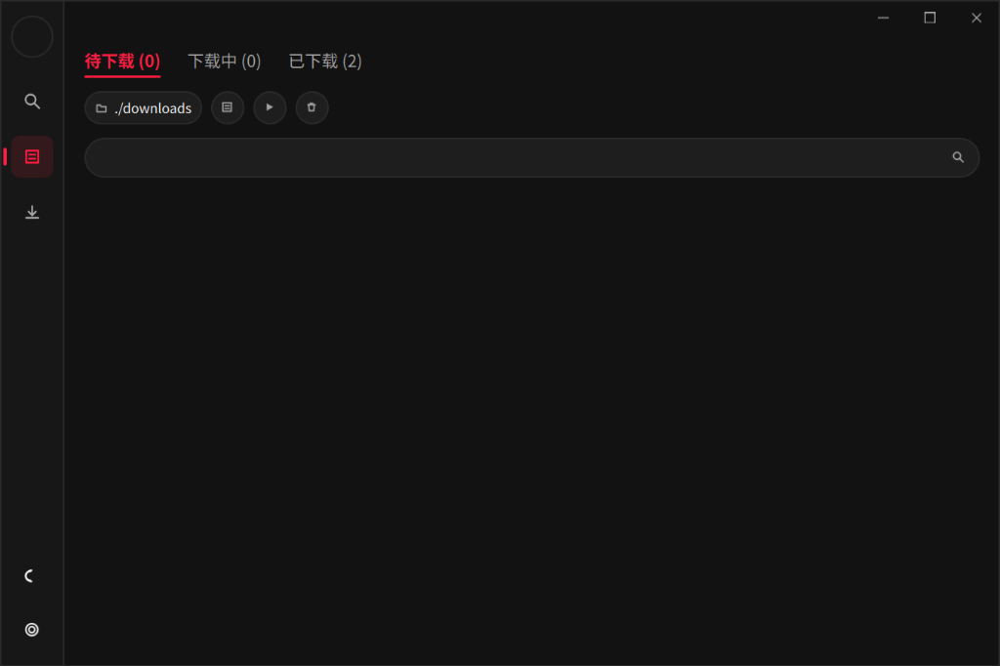

<div align="center">


# KAZUSA

**Native C++ / QML Bilibili Media Downloader & Archiver**

[功能特性](#功能特性) • [技术架构](#技术架构) • [界面预览](#界面预览) • [编译构建](#编译构建) • [开发者](#开发者) • [开源协议](#开源协议)

</div>

---

## 概述

KAZUSA 是基于 Qt 6 (QML) 与 C++17 开发的高性能哔哩哔哩媒体解析与下载工具。前端采用 Fluent 2 规范实现低视觉噪点交互界面，底层集成 Bento4 MP4 多路混流引擎与分片多线程网络下载管线，支持 4K 120FPS、HDR、杜比视界原画流抽取与本地无损封装。

## 界面预览

| 番剧 / 选集解析 | 任务管理队列 |
| :---: | :---: |
|  |  |

## 功能特性

- **高规格解析**: 支持 4K 120FPS、HDR、Hi-Res 无损音频及大会员专享画质解析（需登录账号）。
- **原生混流引擎**: 内置 Bento4 原生 C++ 封装管线，无需调用外部 FFmpeg 进程即可完成音视频流无损混流为标准 MP4。
- **多线程并发分片**: 内置基于 HTTP Range 的分块并发下载器与动态速率控制器（Token Bucket 限速算法）。
- **全链路零外部依赖**: QML 界面、字体、图标及音效全量编译嵌入单一可执行二进制文件（EXE），免安装即开即用。
- **影视级交互设计**: 基于 Fluent 2 与 Apple TV 视觉范式，纯矢量自适应绘制，支持深色/浅色模式无缝热切换。
- **时光隧道归档**: 本地历史记录可视化管理，支持双击调用系统关联播放器。

## 技术架构

```
[ Bilibili Web API ]
         │ (HTTPS / Wbi Sign)
         ▼
[ BiliParser / BiliAuth ] ──── C++17 Core
         │
         ├─► [ MultiThreadDownloader ] ── (HTTP Range 分片并发)
         │           │
         │           ▼
         └─► [ Bento4Muxer ] ──────────── (C++ 原生 MP4 混流封装)
                     │
                     ▼
             [ BiliController ] ──────── (QObject Glue Layer)
                     │
                     ▼
             [ QML / SceneGraph ] ────── (Fluent 2 硬件加速交互界面)
```

### 核心模块说明

| 模块 | 源码路径 | 职责说明 |
| :--- | :--- | :--- |
| `BiliParser` | `cpp_core/BiliParser.cpp` | 视频/番剧元数据解析、Wbi 签名计算、DASH 音视频流地址提取 |
| `BiliAuth` | `cpp_core/BiliAuth.cpp` | 扫码登录、二维码状态轮询、SESSDATA 持久化与用户信息同步 |
| `MultiThreadDownloader` | `cpp_core/MultiThreadDownloader.cpp` | 多线程分块并发下载、断点续传与 Token Bucket 速率控制 |
| `Bento4Muxer` | `cpp_core/Bento4Muxer.cpp` | 基于 Bento4 源码级 MP4 容器原子构造与音视频无损流合并 |
| `BiliController` | `cpp_core/glue/BiliController.cpp` | C++ 核心逻辑与 QML 视图层的双向数据绑定桥接控制器 |
| `QML Frontend` | `qml/` | 声明式硬件加速界面，包含主导航轨、任务队列与设置面板 |

## 编译构建

### 构建环境依赖

- **操作系统**: Windows 10 / 11 (x64)
- **编译工具链**: MSVC 2022 (Visual Studio 2022 Build Tools v143)
- **构建系统**: CMake (>= 3.20), Ninja
- **图形框架**: Qt 6.8.x (MSVC 2022 64-bit, 包含 `Qt6::Quick`, `Qt6::Qml`, `Qt6::Network`)

### 构建步骤

```powershell
# 1. 克隆代码仓库
git clone https://github.com/whte97284-hue/KAZUSA_BILIDOWN.git
cd KAZUSA_BILIDOWN/cpp_core

# 2. 执行编译命令
cmake -S . -B build -G Ninja -DCMAKE_PREFIX_PATH="D:/Qt/6.8.3/msvc2022_64" -DCMAKE_BUILD_TYPE=Release
cmake --build build

# 3. 运行程序
cd build
./BiliCommander.exe
```

## 开发者

- **作者**: Wh1te
- **个人空间**: [Wh1te11 (Bilibili)](https://space.bilibili.com/551898501?spm_id_from=333.788.0.0)

## 开源协议

本项目基于 MIT License 分发与共享。第三方依赖 Bento4 遵循 GPL v2 / Apache 2.0 双许可。